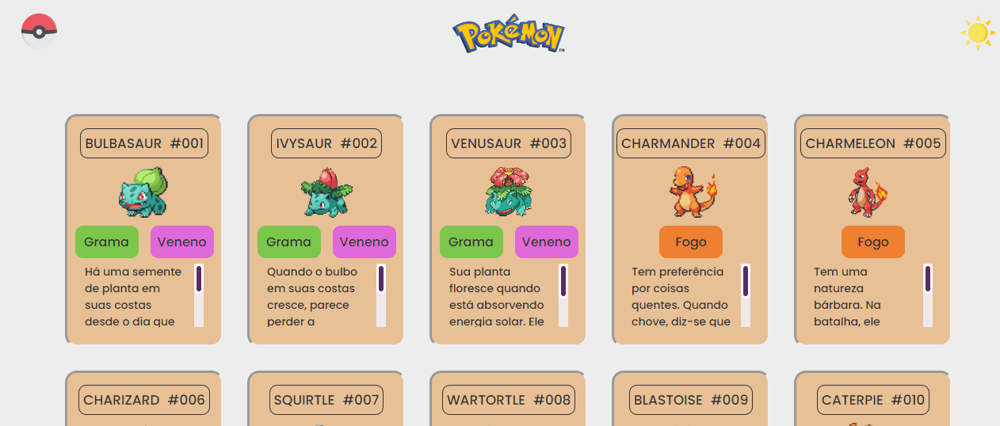

# Projeto Listagem Pokémon
Esse projeto foi realizado com conhecimento básico em HTML, CSS e JavaScript.
O processo de criação foi empolgante e fundamental para a decisão de expandir minhas habilidades nas principais linguagens utilizadas.

## Linguagens 
HTML 5 | CSS3 | JavaScript

## Preview

## Deploy

<a href="https://als-samara.github.io/projeto-listagem-pokemon/" alt="link do deploy" target="_blanket">https://als-samara.github.io/projeto-listagem-pokemon/</a>